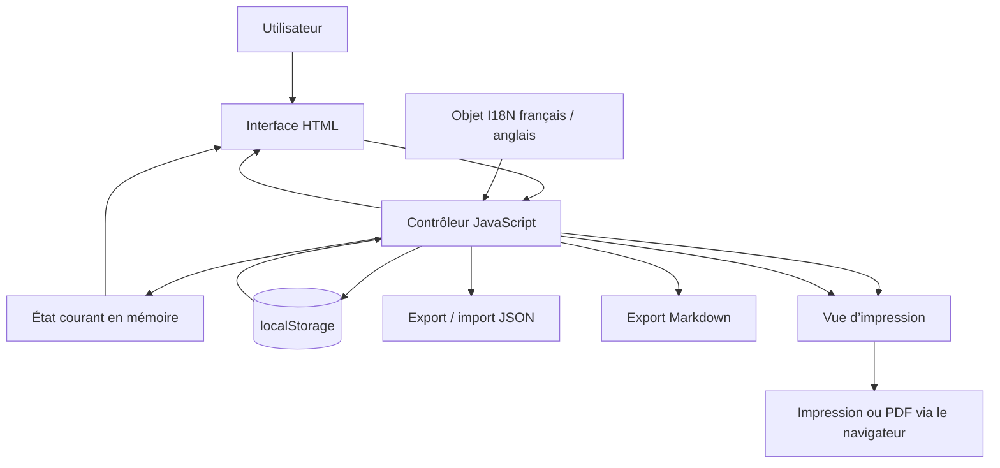
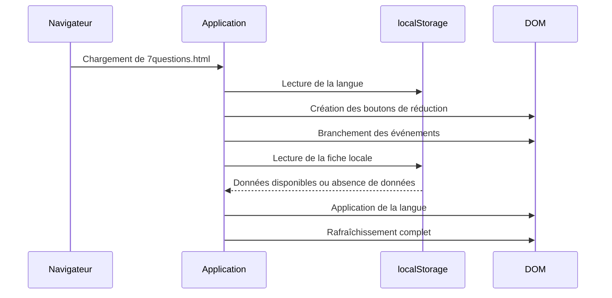
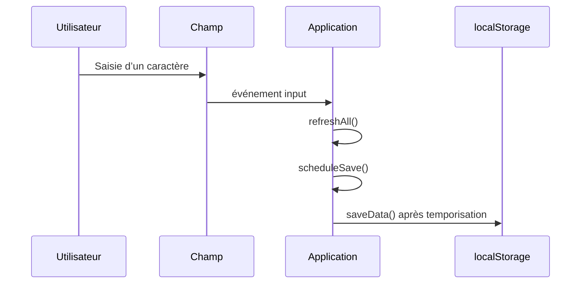

# Architecture de 7 questions

**Programme :** 7 questions  
**Version documentée :** 1.0.0  
**Date :** 29 juillet 2026  
**Auteur :** Simon Léturgie  
**Projet :** Eigrutel Lab — Atelier d’outils libres pour la bande dessinée

---

## 1. Objet du document

Ce document décrit l’architecture technique et fonctionnelle de **7 questions**.

Il a pour objectifs de :

- faciliter la lecture du code source ;
- expliquer la circulation des données dans l’application ;
- permettre à un utilisateur ou à un contributeur de modifier le programme sans casser ses fonctions essentielles ;
- identifier les points d’extension possibles ;
- conserver une trace des choix d’architecture de la version stable 1.0.0.

Ce document décrit l’état réel du fichier `7questions.html`. Les pistes d’évolution sont regroupées dans une section distincte.

---

## 2. Vue d’ensemble

**7 questions** est une application web autonome contenue dans un seul fichier HTML.

```text
7questions.html
├── En-tête juridique et métadonnées
├── Structure HTML de l’interface
├── Feuille de style CSS intégrée
├── Structure HTML réservée à l’impression
└── Code JavaScript intégré
```

L’application ne dépend d’aucun serveur, d’aucune base de données, d’aucune bibliothèque externe et d’aucun service distant.

Elle fonctionne entièrement dans le navigateur.

### Principes d’architecture

1. **Autonomie** : un fichier suffit pour utiliser et distribuer le programme.
2. **Fonctionnement local** : les données restent dans le navigateur ou dans les fichiers exportés par l’utilisateur.
3. **Amélioration progressive** : le formulaire HTML reste lisible, tandis que JavaScript ajoute les fonctions avancées.
4. **Séparation logique** : HTML, CSS et JavaScript sont réunis physiquement dans un fichier, mais organisés en sections distinctes.
5. **Bilinguisme centralisé** : tous les textes variables de l’interface sont regroupés dans un objet de traduction.
6. **Portabilité** : les fiches peuvent être exportées et réimportées au format JSON.
7. **Impression dédiée** : l’affichage écran et la mise en page imprimée sont séparés.

---

## 3. Schéma général



---

## 4. Architecture d’exécution

L’application est initialisée dans une **fonction immédiatement invoquée** — IIFE :

```js
(function () {
  // Application
})();
```

Cette enveloppe évite de créer des variables globales accessibles depuis le reste de la page ou depuis d’autres scripts.

### Séquence de démarrage

Lors du chargement du fichier :

1. les constantes et les références vers les éléments HTML sont créées ;
2. la langue mémorisée est lue dans `localStorage` ;
3. les boutons de réduction sont ajoutés aux cartes ;
4. les gestionnaires d’événements sont attachés ;
5. une éventuelle fiche enregistrée localement est chargée ;
6. la langue française ou anglaise est appliquée ;
7. l’ensemble de l’interface est recalculé.



---

## 5. Structure HTML

La structure HTML comprend deux représentations du même contenu.

### 5.1 Interface interactive

La partie principale est contenue dans :

```html
<main class="qq-panel">
```

Elle comprend :

- l’en-tête de l’application ;
- le bouton de changement de langue ;
- le titre public `7 questions` ;
- le sous-titre variable ;
- la barre de progression ;
- le champ **Sujet** ;
- les sept cartes de questions ;
- la carte **Notes** ;
- les boutons d’action.

### 5.2 Vue d’impression

La vue imprimable est contenue dans :

```html
<section class="qq-print">
```

Elle est masquée à l’écran et affichée uniquement dans les styles `@media print`.

Avant l’impression, JavaScript copie le contenu du formulaire dans cette structure.

Cette séparation évite de devoir transformer l’interface interactive au moment de l’impression.

### 5.3 Identifiants des champs

Les données utilisent les identifiants suivants :

| Identifiant | Français | Anglais |
|---|---|---|
| `subject` | Sujet | Subject |
| `qui` | Qui ? | Who? |
| `quand` | Quand ? | When? |
| `ou` | Où ? | Where? |
| `quoi` | Quoi ? | What? |
| `combien` | Combien ? | How much? |
| `comment` | Comment ? | How? |
| `pourquoi` | Pourquoi ? | Why? |
| `notes` | Notes | Notes |

Ces identifiants sont stables et indépendants de la langue affichée. Ils servent de lien entre le HTML, JavaScript, les sauvegardes locales et les fichiers JSON.

---

## 6. Architecture CSS

La feuille de style est intégrée dans la balise `<style>`.

### 6.1 Variables graphiques

Les principales couleurs et valeurs communes sont déclarées dans `:root` :

```css
:root {
  --page-bg: ...;
  --card-bg: ...;
  --bleu-atelier: ...;
  --rouge-atelier: ...;
  --ocre: ...;
}
```

Cette organisation permet de modifier la charte générale sans rechercher chaque couleur dans toute la feuille de style.

### 6.2 Blocs principaux

Les styles sont organisés par responsabilité :

- structure générale ;
- titraille et changement de langue ;
- formulaire ;
- cartes ;
- boutons d’aide ;
- verrouillage ;
- réduction des cartes ;
- actions ;
- pied de page ;
- impression ;
- adaptation responsive.

### 6.3 États visuels

JavaScript applique ou retire des classes CSS pour représenter l’état courant :

| Classe | Rôle |
|---|---|
| `.is-filled` | Champ ou carte contenant une valeur |
| `.is-locked` | Carte verrouillée |
| `.is-collapsed` | Carte repliée |
| `.is-long` | Titre long |
| `.is-very-long` | Titre très long |

Le style dépend donc de classes descriptives, et non de styles injectés directement par JavaScript.

### 6.4 Impression

La section `@media print` :

- masque l’interface interactive ;
- affiche `.qq-print` ;
- impose une page A4 ;
- adapte les tailles typographiques ;
- conserve les retours à la ligne ;
- prépare une sortie compatible avec l’impression papier ou le PDF du navigateur.

---

## 7. Architecture JavaScript

Le code JavaScript assure cinq responsabilités principales :

1. gestion de l’état de la fiche ;
2. persistance locale ;
3. internationalisation ;
4. export et import ;
5. synchronisation de l’interface.

### 7.1 Constantes de stockage

```js
const STORAGE_KEY = 'eigrutel_fiche_qqoqccp_v1';
const LANGUAGE_KEY = 'eigrutel_7questions_language_v1';
```

- `STORAGE_KEY` contient la fiche de travail courante ;
- `LANGUAGE_KEY` contient la préférence linguistique.

La clé historique de la fiche est conservée pour éviter de rendre incompatibles les sauvegardes locales créées avant le changement de nom public.

### 7.2 État en mémoire

L’état courant est réparti entre :

- les valeurs présentes dans les champs HTML ;
- l’objet `locked`, qui mémorise les cartes verrouillées ;
- l’objet `collapsed`, qui mémorise les cartes repliées ;
- la variable `currentLanguage`, qui contient `fr` ou `en`.

Il n’existe pas de classe ni de gestionnaire d’état externe. Le DOM constitue la source immédiate des valeurs saisies.

---

## 8. Internationalisation

Les traductions sont regroupées dans l’objet :

```js
const I18N = {
  fr: { ... },
  en: { ... }
};
```

Chaque langue contient notamment :

- le titre du document ;
- le sous-titre de méthode ;
- les libellés des champs ;
- les textes d’aide ;
- les boutons ;
- les messages de confirmation et d’erreur ;
- les textes utilisés dans les exports ;
- les libellés de la version imprimée.

### Fonctionnement du changement de langue

La fonction `applyLanguage()` :

1. sélectionne le dictionnaire actif ;
2. met à jour l’attribut `lang` du document ;
3. met à jour les textes et attributs d’accessibilité ;
4. met à jour les aides et espaces réservés ;
5. met à jour les boutons de verrouillage et de réduction ;
6. met à jour la vue imprimée ;
7. mémorise la préférence si demandé.

Le contenu saisi par l’utilisateur n’est jamais traduit automatiquement.

### Ajouter une langue

Pour ajouter une langue :

1. ajouter une nouvelle entrée dans `I18N` ;
2. fournir toutes les clés utilisées par `applyLanguage()` ;
3. adapter le mécanisme de sélection, actuellement conçu pour deux langues ;
4. ajouter une valeur acceptée dans la lecture de `LANGUAGE_KEY` ;
5. vérifier les exports Markdown et l’impression.

---

## 9. Modèle de données

### 9.1 Données de formulaire

La fonction `getData()` produit un objet contenant les valeurs des neuf champs.

Structure logique :

```json
{
  "subject": "",
  "qui": "",
  "quand": "",
  "ou": "",
  "quoi": "",
  "combien": "",
  "comment": "",
  "pourquoi": "",
  "notes": ""
}
```

### 9.2 État de l’interface

La sauvegarde portable ajoute les états de verrouillage et de réduction :

```json
{
  "app": "7 questions",
  "version": 1,
  "language": "fr",
  "fields": {
    "subject": "...",
    "qui": "..."
  },
  "locked": {
    "qui": false
  },
  "collapsed": {
    "qui": false
  }
}
```

La structure exacte est produite par `buildPortableData()`.

### 9.3 Compatibilité d’import

La fonction `importPortableData()` centralise la lecture des données importées.

Elle évite de disperser la logique de compatibilité dans l’interface et permet de prendre en charge une structure sauvegardée avant de l’appliquer aux champs.

---

## 10. Persistance locale

### 10.1 Sauvegarde automatique

À chaque saisie :

1. l’interface est rafraîchie immédiatement ;
2. une sauvegarde différée est programmée par `scheduleSave()`.

La temporisation évite d’écrire dans `localStorage` à chaque frappe sans délai.



### 10.2 Chargement

`loadData()` :

- lit la clé locale ;
- analyse le JSON ;
- restaure les valeurs ;
- restaure les verrouillages et replis ;
- ignore proprement une sauvegarde absente ou inutilisable.

### 10.3 Limites

`localStorage` est propre :

- au navigateur ;
- au profil utilisateur ;
- à l’origine ou au contexte d’ouverture du fichier ;
- à l’appareil utilisé.

La sauvegarde JSON reste donc le mécanisme recommandé pour archiver ou transférer une fiche.

---

## 11. Export et import JSON

### Export

Chaîne d’appel :

```text
Bouton « Sauvegarder la fiche »
    → saveData()
    → exportJsonFile()
    → buildPortableData()
    → création d’un Blob
    → téléchargement du fichier
```

Le nom du fichier est dérivé du sujet grâce à `slugifyFileName()`.

### Import

Chaîne d’appel :

```text
Bouton « Charger une fiche »
    → ouverture du sélecteur de fichier
    → loadJsonFile(file)
    → lecture FileReader
    → JSON.parse()
    → importPortableData(data)
    → mise à jour du formulaire
    → sauvegarde locale
    → rafraîchissement
```

Les erreurs de lecture ou de format sont interceptées et affichées dans la langue active.

---

## 12. Export Markdown

L’export Markdown est construit en mémoire par `buildMarkdown()`.

La fonction :

- récupère les valeurs courantes ;
- utilise les libellés de la langue active ;
- échappe les caractères susceptibles de perturber la syntaxe Markdown ;
- produit un document structuré ;
- transmet le résultat à `exportMarkdownFile()`.

Chaîne d’appel :

```text
Bouton « Exporter Markdown »
    → saveData()
    → exportMarkdownFile()
    → buildMarkdown()
    → création d’un Blob texte
    → téléchargement du fichier .md
```

---

## 13. Impression et PDF

Le programme ne génère pas directement un fichier PDF.

Il utilise la fonction d’impression du navigateur :

```js
window.print();
```

Avant son ouverture, `updatePrintVersion()` :

- copie les valeurs dans la structure `.qq-print` ;
- applique les libellés de la langue active ;
- construit le titre imprimé ;
- met à jour la mention de méthode.

Le navigateur ou le système d’exploitation assure ensuite l’impression ou l’enregistrement en PDF.

---

## 14. Synchronisation de l’interface

La fonction `refreshAll()` sert de point central de mise à jour.

Elle appelle les fonctions spécialisées qui recalculent :

- le titre dynamique ;
- les états remplis ;
- la progression ;
- les verrouillages ;
- les cartes repliées ;
- la vue imprimée.

Cette fonction limite les oublis : après une modification importante, un seul appel suffit pour remettre l’interface en cohérence.

---

## 15. Index des fonctions

| Fonction | Responsabilité principale |
|---|---|
| `t()` | Retourner le dictionnaire de traduction actif |
| `setupCollapseButtons()` | Ajouter les boutons de réduction aux cartes |
| `slugifyFileName(value)` | Transformer un texte en nom de fichier sûr |
| `buildPortableData()` | Construire l’objet complet destiné à l’export JSON |
| `importPortableData(data)` | Valider et appliquer des données importées |
| `exportJsonFile()` | Créer et télécharger une sauvegarde JSON |
| `escapeMarkdown(value)` | Protéger les caractères spéciaux Markdown |
| `buildMarkdown()` | Construire le contenu Markdown de la fiche |
| `exportMarkdownFile()` | Créer et télécharger le fichier Markdown |
| `loadJsonFile(file)` | Lire et importer un fichier JSON sélectionné |
| `getField(id)` | Retourner un champ HTML à partir de son identifiant |
| `getData()` | Lire les valeurs courantes du formulaire |
| `setData(data)` | Injecter des valeurs dans le formulaire |
| `getCurrentTitle()` | Déterminer le titre courant de la fiche |
| `updateTitle()` | Mettre à jour le titre dynamique affiché |
| `updateFilledStates()` | Appliquer les états visuels des champs remplis |
| `updateCompletion()` | Calculer et afficher le taux de complétion |
| `updateLocks()` | Appliquer les verrouillages et leurs libellés |
| `updateCollapsedCards()` | Appliquer les états repliés et leurs libellés |
| `saveData()` | Enregistrer la fiche dans `localStorage` |
| `scheduleSave()` | Différer et regrouper les sauvegardes automatiques |
| `loadData()` | Restaurer la fiche depuis `localStorage` |
| `updatePrintVersion()` | Synchroniser la vue destinée à l’impression |
| `applyLanguage(savePreference)` | Traduire l’interface et mémoriser la langue |
| `refreshAll()` | Recalculer l’ensemble de l’interface |
| `clearAll()` | Réinitialiser les champs et états après confirmation |

---

## 16. Événements utilisateur

Les principaux événements sont attachés à la fin du script.

| Événement | Action |
|---|---|
| `input` sur un champ | Rafraîchissement et sauvegarde différée |
| clic sur un cadenas | Basculement du verrouillage |
| clic sur un bouton de réduction | Repli ou dépli de la carte |
| clic sur le bouton de langue | Passage français ↔ anglais |
| clic sur Export PDF | Préparation puis impression |
| clic sur Export Markdown | Création du fichier Markdown |
| clic sur Sauvegarder | Création du fichier JSON |
| clic sur Charger | Ouverture du sélecteur de fichier |
| `change` du sélecteur | Lecture du fichier JSON |
| clic sur Réinitialiser | Effacement après confirmation |
| `beforeprint` | Mise à jour finale de la vue imprimée |
| `submit` du formulaire | Blocage de l’envoi HTML classique |

---

## 17. Accessibilité

L’architecture intègre plusieurs éléments d’accessibilité :

- attribut `lang` du document mis à jour selon la langue ;
- libellés `aria-label` traduits ;
- états `aria-pressed` sur les boutons de verrouillage ;
- boutons réels pour les actions interactives ;
- titres hiérarchisés ;
- contrastes visuels distincts ;
- fonctionnement au clavier via les contrôles HTML natifs ;
- version imprimée séparée de l’interface interactive.

Toute modification de l’interface doit conserver la mise à jour des attributs d’accessibilité dans `applyLanguage()`, `updateLocks()` et `updateCollapsedCards()`.

---

## 18. Sécurité et vie privée

### Données

- aucune donnée n’est envoyée à un serveur ;
- aucune analyse d’audience n’est intégrée ;
- aucun cookie n’est créé par l’application ;
- aucun compte utilisateur n’est requis ;
- les fichiers importés sont lus localement par le navigateur.

### Import JSON

Les données importées sont traitées comme des valeurs de formulaire. Elles ne sont pas exécutées comme du code.

Le programme utilise les propriétés de texte des éléments HTML pour afficher les valeurs, ce qui limite les risques d’injection de balises.

### Dépendances

L’absence de bibliothèques externes réduit :

- les risques liés à une chaîne de dépendances ;
- les changements inattendus causés par une mise à jour distante ;
- les indisponibilités réseau ;
- le suivi par des services tiers.

---

## 19. Compatibilité et contraintes

Le programme repose sur des fonctions courantes des navigateurs modernes :

- `localStorage` ;
- `FileReader` ;
- `Blob` ;
- téléchargement par URL objet ;
- sélecteur de fichier ;
- CSS Grid et Flexbox ;
- règles `@media print`.

Les principaux points à tester sont :

- ouverture locale du fichier ;
- persistance de `localStorage` ;
- téléchargement de fichiers sur iOS et iPadOS ;
- import JSON ;
- aperçu avant impression ;
- génération PDF ;
- affichage des aides contextuelles au clavier et au toucher ;
- comportement des cartes sur petit écran.

---

## 20. Points d’extension

### Ajouter un champ

L’ajout d’une nouvelle rubrique exige de modifier plusieurs zones :

1. le HTML interactif ;
2. la vue imprimée ;
3. les listes de champs JavaScript ;
4. l’objet `I18N` pour chaque langue ;
5. `getData()` et `setData()` si les listes ne suffisent pas ;
6. l’export Markdown ;
7. la sauvegarde JSON ;
8. le calcul de progression ;
9. les tests d’impression et d’import.

### Ajouter une langue

Voir la section **Internationalisation**. Le sélecteur actuel est binaire et devra devenir un menu ou une liste si une troisième langue est ajoutée.

### Modifier le format JSON

Toute modification du format portable doit :

- incrémenter son numéro de version interne ;
- conserver si possible la lecture des versions précédentes ;
- être centralisée dans `buildPortableData()` et `importPortableData()` ;
- être documentée dans `CHANGELOG.md`.

### Séparer les fichiers

La version 1.0.0 privilégie le fichier unique.

Une évolution vers plusieurs fichiers pourrait adopter :

```text
7questions/
├── index.html
├── css/
│   └── 7questions.css
├── js/
│   ├── app.js
│   ├── i18n.js
│   ├── storage.js
│   └── exports.js
└── docs/
```

Cette évolution améliorerait la modularité, mais supprimerait l’avantage d’un programme immédiatement transportable dans un seul fichier.

---

## 21. Règles de maintenance recommandées

Avant toute nouvelle version stable :

1. conserver une copie de la version précédente ;
2. mettre à jour le numéro de version dans l’en-tête du fichier ;
3. vérifier les deux langues ;
4. tester la conservation des anciennes sauvegardes locales ;
5. tester l’export puis le réimport JSON ;
6. tester l’export Markdown ;
7. tester l’impression et le PDF ;
8. tester ordinateur, tablette et téléphone ;
9. tester plusieurs navigateurs ;
10. mettre à jour `README.md`, `CHANGELOG.md` et le présent document si l’architecture change.

---

## 22. Tests minimaux de non-régression

### Démarrage

- le fichier s’ouvre sans erreur visible ;
- le français est utilisé lors d’une première ouverture ;
- la langue précédemment choisie est restaurée.

### Saisie

- chaque champ accepte le texte et les retours à la ligne ;
- le titre reprend le sujet ;
- la barre de progression évolue ;
- les cartes remplies changent d’apparence.

### Verrouillage et réduction

- un champ verrouillé n’est plus modifiable ;
- son état est conservé après rechargement ;
- une carte repliée se rouvre correctement ;
- l’état replié est conservé.

### Sauvegarde

- la saisie revient après fermeture et réouverture ;
- un fichier JSON est téléchargé ;
- ce fichier peut être réimporté ;
- une erreur est signalée pour un JSON invalide.

### Langues

- tous les textes fonctionnels passent en anglais ;
- tous les textes reviennent en français ;
- les contenus saisis restent inchangés ;
- les libellés imprimés suivent la langue active.

### Exports

- le Markdown contient toutes les rubriques ;
- le JSON contient les valeurs et les états ;
- le PDF affiche le titre, le sujet et les réponses ;
- les textes longs restent lisibles à l’impression.

### Réinitialisation

- une confirmation est demandée ;
- l’annulation conserve les données ;
- la validation efface les valeurs et les états attendus.

---

## 23. Décisions d’architecture de la version 1.0.0

### ADR-001 — Distribution dans un fichier unique

**Décision :** conserver HTML, CSS et JavaScript dans `7questions.html`.

**Motifs :**

- simplicité de téléchargement ;
- fonctionnement hors ligne ;
- facilité de copie et d’archivage ;
- absence de procédure d’installation.

**Contrepartie :** le fichier devient plus long qu’une architecture séparée en modules.

### ADR-002 — Stockage local sans serveur

**Décision :** utiliser `localStorage` et les exports JSON.

**Motifs :**

- confidentialité ;
- simplicité ;
- autonomie ;
- absence de compte.

**Contrepartie :** aucune synchronisation automatique entre appareils.

### ADR-003 — Traductions centralisées dans JavaScript

**Décision :** regrouper les traductions dans `I18N`.

**Motifs :**

- une seule interface HTML ;
- changement immédiat de langue ;
- cohérence entre interface et exports.

**Contrepartie :** toute nouvelle langue doit fournir l’ensemble des clés.

### ADR-004 — Vue d’impression distincte

**Décision :** maintenir une structure HTML spécifique à l’impression.

**Motifs :**

- mise en page plus stable ;
- interface écran non perturbée ;
- contrôle des libellés et de la hiérarchie imprimée.

**Contrepartie :** les nouveaux champs doivent être ajoutés deux fois dans le HTML.

### ADR-005 — Aucun cadre logiciel externe

**Décision :** utiliser JavaScript natif.

**Motifs :**

- aucune dépendance ;
- pérennité ;
- poids réduit ;
- compréhension plus directe par les utilisateurs.

**Contrepartie :** certaines fonctions utilitaires doivent être maintenues dans le programme.

---

## 24. Fichiers documentaires associés

```text
7questions.html   Programme stable
README.md         Présentation et mode d’emploi
ARCHITECTURE.md   Architecture technique et fonctionnelle
CHANGELOG.md      Historique des versions
notice.md         Attribution, licences et marques
LICENSE           Texte complet de la licence du code
```

---

## 25. Licence du document

Sauf mention contraire, ce document est diffusé sous licence **Creative Commons Attribution — Partage dans les mêmes conditions 4.0 International — CC BY-SA 4.0**.

**Attribution recommandée :**

> Architecture de 7 questions — Simon Léturgie / Eigrutel Lab / Eigrutel BD Academy — CC BY-SA 4.0.

Les marques, logos et signes distinctifs **Eigrutel**, **Eigrutel Lab** et **Eigrutel BD Academy** restent réservés.
