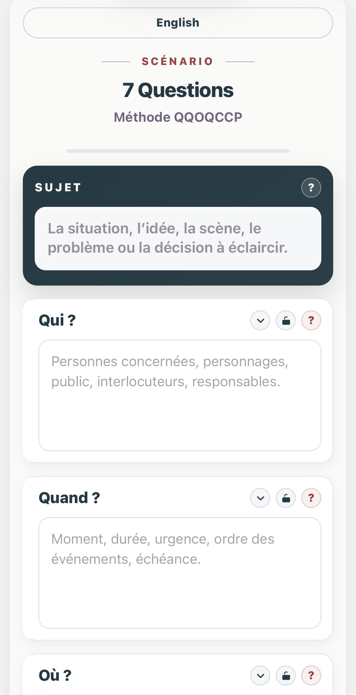

# 7 questions

**Version 1.0.0 — 29 juillet 2026**

Application web bilingue fondée sur les méthodes **QQOQCCP** en français et **5W2H** en anglais.

## Aperçu


<p align="center">
  
  
</p>

**7 questions** permet d’examiner un sujet, une situation, une scène, un problème ou une décision à travers sept interrogations :

- Qui ? / Who?
- Quand ? / When?
- Où ? / Where?
- Quoi ? / What?
- Combien ? / How much?
- Comment ? / How?
- Pourquoi ? / Why?

Le programme est conçu et développé par **Simon Léturgie** dans le cadre d’**Eigrutel BD Academy** et d’**Eigrutel Lab — Atelier d’outils libres pour la bande dessinée**.

---

## Français

### Présentation

**7 questions** est une application web autonome réunie dans un unique fichier HTML. Elle ne nécessite ni installation, ni serveur, ni connexion à Internet.

L’interface est affichée en français lors de la première ouverture. Un bouton permet de passer à la version anglaise. La langue choisie est ensuite mémorisée dans le navigateur.

Le programme peut être utilisé directement depuis un ordinateur, une tablette ou un téléphone équipé d’un navigateur web moderne.

### Fonctionnalités

- interface bilingue français–anglais ;
- français utilisé par défaut ;
- mémorisation de la langue sélectionnée dans le navigateur ;
- champ principal consacré au sujet étudié ;
- sept champs correspondant aux questions QQOQCCP / 5W2H ;
- champ de notes complémentaires ;
- aides contextuelles pour chaque rubrique ;
- verrouillage individuel des rubriques afin de protéger leur contenu ;
- réduction et réouverture des cartes ;
- indicateur visuel de progression ;
- sauvegarde automatique locale dans le navigateur ;
- export de la fiche au format JSON ;
- import d’une fiche JSON précédemment enregistrée ;
- export au format Markdown ;
- mise en page dédiée à l’impression et à l’enregistrement en PDF ;
- interface responsive adaptée aux différentes tailles d’écran.

### Installation et lancement

Aucune installation n’est nécessaire.

1. Téléchargez le fichier `7questions.html`.
2. Conservez-le dans le dossier de votre choix.
3. Ouvrez-le avec un navigateur web moderne.

Le fichier peut également être placé sur un serveur web ou intégré à un site, sous réserve du respect de la licence.

### Utilisation

1. Indiquez le sujet à étudier.
2. Complétez les sept rubriques.
3. Utilisez le champ **Notes** pour conserver les idées ou pistes complémentaires.
4. Verrouillez une rubrique lorsque son contenu ne doit plus être modifié accidentellement.
5. Utilisez les boutons situés en bas de la fiche pour imprimer, exporter, sauvegarder, charger ou réinitialiser le travail.

Le titre affiché dans la fiche imprimée ou exportée est construit à partir du contenu du champ **Sujet**. Lorsque ce champ est vide, le titre par défaut reste **7 questions**.

### Changement de langue

Le bouton situé en haut de l’interface affiche la langue disponible :

- **English** dans l’interface française ;
- **Français** dans l’interface anglaise.

Le changement de langue traduit l’interface, les aides, les boutons, les messages et les libellés de la version imprimée. Le contenu saisi par l’utilisateur n’est pas traduit ni modifié.

La préférence linguistique est enregistrée localement dans le navigateur.

### Sauvegarde des données

Le programme utilise deux mécanismes complémentaires.

#### Sauvegarde automatique

Le contenu courant est enregistré automatiquement dans le stockage local du navigateur (`localStorage`).

Cette sauvegarde :

- reste sur l’appareil et dans le navigateur utilisés ;
- n’est transmise à aucun serveur ;
- peut disparaître si les données du navigateur sont effacées ;
- n’est pas automatiquement partagée entre plusieurs appareils ou navigateurs.

#### Fichier JSON

Le bouton **Sauvegarder la fiche** crée un fichier JSON portable. Ce fichier permet d’archiver une fiche ou de la transférer vers un autre appareil.

Le bouton **Charger une fiche** permet de réimporter ce fichier.

Il est recommandé d’utiliser régulièrement l’export JSON pour conserver une copie indépendante du navigateur.

### Export Markdown

L’export Markdown produit un fichier texte structuré comportant :

- le titre de la fiche ;
- le sujet ;
- les sept questions et leurs réponses ;
- les notes ;
- une mention de la méthode utilisée.

Le document peut ensuite être ouvert dans un éditeur de texte, un logiciel de prise de notes ou toute application compatible avec Markdown.

### Impression et export PDF

Le bouton **Exporter en PDF** ouvre la fonction d’impression du navigateur.

Pour créer un PDF :

1. cliquez sur **Exporter en PDF** ;
2. choisissez l’option d’enregistrement au format PDF proposée par le navigateur ou le système ;
3. vérifiez l’aperçu avant validation.

La feuille d’impression utilise une mise en page A4 distincte de l’interface affichée à l’écran.

### Vie privée

**7 questions** ne contient aucun système de compte, de suivi, de publicité ou de transmission de données.

Toutes les informations saisies restent localement dans le navigateur, sauf lorsqu’un utilisateur choisit lui-même d’exporter ou de partager un fichier.

### Compatibilité

Le programme est conçu pour les versions récentes des principaux navigateurs :

- Firefox ;
- Chromium et Google Chrome ;
- Microsoft Edge ;
- Safari sur macOS, iPadOS et iOS.

Avant diffusion définitive, la version 1.0.0 doit être vérifiée sur plusieurs navigateurs, systèmes et tailles d’écran.

### Structure technique

Le programme est contenu dans un fichier unique :

```text
7questions.html
```

Ce fichier regroupe :

- la structure HTML ;
- la feuille de style CSS ;
- le code JavaScript ;
- les textes français et anglais ;
- la mise en page d’impression.

Aucune bibliothèque externe ni dépendance n’est requise.

Le code est organisé et commenté en français et en anglais afin de faciliter sa lecture, son adaptation et sa contribution.

### Modifier ou contribuer au programme

Le fichier 7questions.html peut être ouvert dans un éditeur de code ou de texte.

Les traductions de l’interface sont regroupées dans l’objet JavaScript I18N. Les styles sont intégrés dans la section <style> et le fonctionnement dans la section <script>.

Toute personne peut étudier, modifier et redistribuer le programme dans le respect de la licence GNU AGPL v3.0 ou version ultérieure.

Avant de proposer ou de diffuser une modification, il est recommandé de :

vérifier le fonctionnement dans les deux langues ;
tester l’import et l’export JSON ;
tester l’impression et l’export PDF ;
contrôler l’affichage sur ordinateur, tablette et téléphone ;
documenter clairement les changements apportés.

### Fichiers prévus pour le dépôt

Le dépôt doit comprendre au minimum :

```text
7questions.html
README.md
LICENSE
NOTICE
CHANGELOG.md
```

### Auteur

**Simon Léturgie**  
Eigrutel BD Academy  
Eigrutel Lab — Atelier d’outils libres pour la bande dessinée

Site : [stripmee.com](https://www.stripmee.com)

### Licences

Le code du programme est diffusé sous licence **GNU Affero General Public License v3.0 ou version ultérieure**.

La documentation et les modèles sont diffusés sous licence **Creative Commons Attribution — Partage dans les mêmes conditions 4.0 International**, sauf mention contraire.

Les marques, logos et signes distinctifs **Eigrutel**, **Eigrutel Lab** et **Eigrutel BD Academy** sont réservés et ne sont pas couverts par les licences libres du code et de la documentation.

Les textes juridiques complets seront fournis dans les fichiers `LICENSE` et `NOTICE` du dépôt.

---

## English

### Overview

**7 questions** is a self-contained web application based on the French **QQOQCCP** method and the English **5W2H** method.

The whole application is contained in a single HTML file. It requires no installation, server, Internet connection, external library, or dependency.

The interface is displayed in French on first launch. A button switches it to English, and the selected language is remembered by the browser.

The program can be used on a computer, tablet, or phone with a modern web browser.

### Features

- bilingual French–English interface;
- French selected by default;
- browser-based language preference;
- main field for the subject being examined;
- seven QQOQCCP / 5W2H question fields;
- additional notes field;
- contextual help for every section;
- individual field locking to prevent accidental changes;
- collapsible and expandable cards;
- visual completion indicator;
- automatic local browser saving;
- JSON sheet export;
- JSON sheet import;
- Markdown export;
- print layout and PDF export through the browser;
- responsive interface for different screen sizes.

### Installation and launch

No installation is required.

1. Download `7questions.html`.
2. Store it in any folder.
3. Open it in a modern web browser.

The file may also be hosted on a web server or included in a website, provided that the licence terms are respected.

### Usage

1. Enter the subject to examine.
2. Complete the seven question fields.
3. Use the **Notes** field for additional ideas or leads.
4. Lock a field when its content should no longer be changed accidentally.
5. Use the buttons at the bottom of the sheet to print, export, save, load, or reset the work.

The title used in printed and exported documents is generated from the **Subject** field. When this field is empty, the default title remains **7 questions**.

### Language switch

The button at the top of the interface displays the available language:

- **English** in the French interface;
- **Français** in the English interface.

Switching languages translates the interface, contextual help, buttons, messages, and print labels. User-entered content is never translated or modified.

The selected language is stored locally in the browser.

### Data storage

The application provides two complementary saving methods.

#### Automatic saving

Current content is automatically stored in the browser's local storage (`localStorage`).

This data:

- remains on the current device and browser;
- is not transmitted to any server;
- may be lost if browser data is cleared;
- is not automatically shared between devices or browsers.

#### JSON file

The **Save sheet** button creates a portable JSON file. It can be used to archive a sheet or transfer it to another device.

The **Load sheet** button imports a previously exported file.

Regular JSON exports are recommended to keep a copy independent from the browser.

### Markdown export

The Markdown export creates a structured text file containing:

- the sheet title;
- the subject;
- the seven questions and their answers;
- the notes;
- a reference to the method used.

The file can then be opened in a text editor, note-taking application, or any Markdown-compatible program.

### Printing and PDF export

The **Export PDF** button opens the browser's print function.

To create a PDF:

1. click **Export PDF**;
2. choose the system or browser option to save as PDF;
3. check the print preview before confirming.

The print version uses a dedicated A4 layout separate from the on-screen interface.

### Privacy

**7 questions** contains no user account, analytics, advertising, tracking, or data transmission system.

All entered information remains in the browser unless the user deliberately exports or shares a file.

### Compatibility

The application is designed for recent versions of the main browsers:

- Firefox;
- Chromium and Google Chrome;
- Microsoft Edge;
- Safari on macOS, iPadOS, and iOS.

Before final publication, version 1.0.0 should be tested on several browsers, operating systems, and screen sizes.

### Technical structure

The application is contained in one file:

```text
7questions.html
```

This file includes:

- HTML structure;
- CSS styles;
- JavaScript code;
- French and English interface text;
- print styles.

No external library or dependency is required.

The code is structured and commented in both French and English to make it easier to read, adapt, and contribute to.

### Modifying the application

Open `7questions.html` in a code editor or text editor.

Interface translations are grouped in the JavaScript `I18N` object. Styles are included in the `<style>` section, and application logic is included in the `<script>` section.

When modifying the application:

1. keep a copy of the stable release;
2. update the version number;
3. document changes in `CHANGELOG.md`;
4. test JSON import and export;
5. test printing;
6. check both languages;
7. verify the interface on desktop, tablet, and phone.

### Planned repository files

The repository should contain at least:

```text
7questions.html
README.md
LICENSE
NOTICE
CHANGELOG.md
```

### Author

**Simon Léturgie**  
Eigrutel BD Academy  
Eigrutel Lab — Free Tools Workshop for Comics

Website: [stripmee.com](https://www.stripmee.com)

### Licences

The program source code is released under the **GNU Affero General Public License v3.0 or any later version**.

Documentation and templates are released under the **Creative Commons Attribution-ShareAlike 4.0 International licence**, unless otherwise stated.

The **Eigrutel**, **Eigrutel Lab**, and **Eigrutel BD Academy** names, trademarks, logos, and other distinctive signs are reserved and are not covered by the free licences applying to the code and documentation.

The complete legal terms will be provided in the repository's `LICENSE` and `NOTICE` files.
